# 一起学日语

用gemini设计和claude+codex编写的。

想法太多了，有的地方还有不足，但是整体已经可以使用了。

下载地址:[github](https://github.com/glitterlip/japanese-learning/releases/tag/preview)

放一些截图。

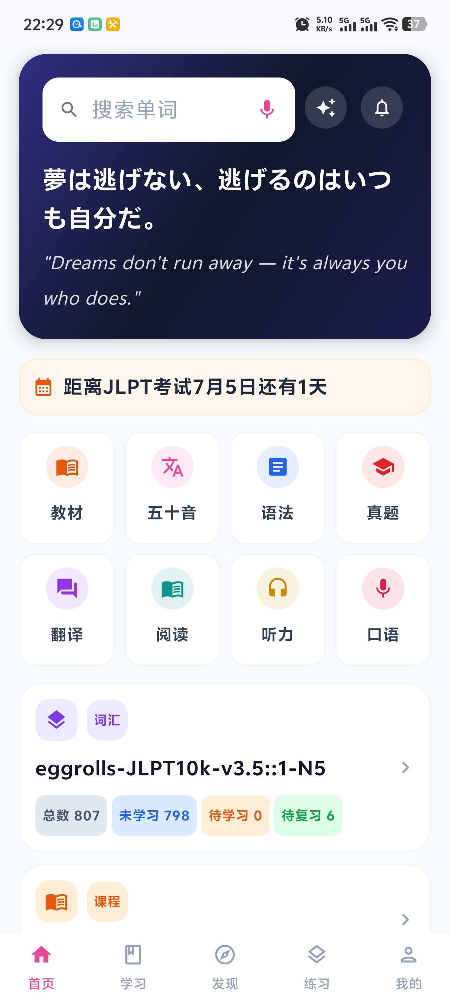
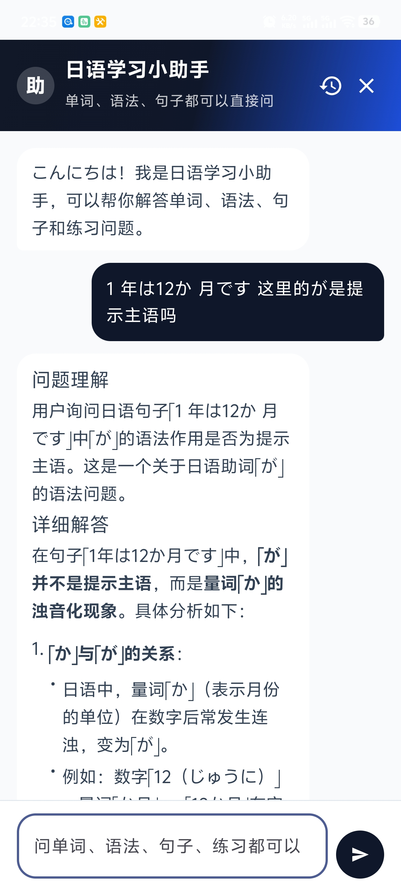
口语对话目前使用的gemini，需要你自行申请key使用，每个人每天都有免费额度。
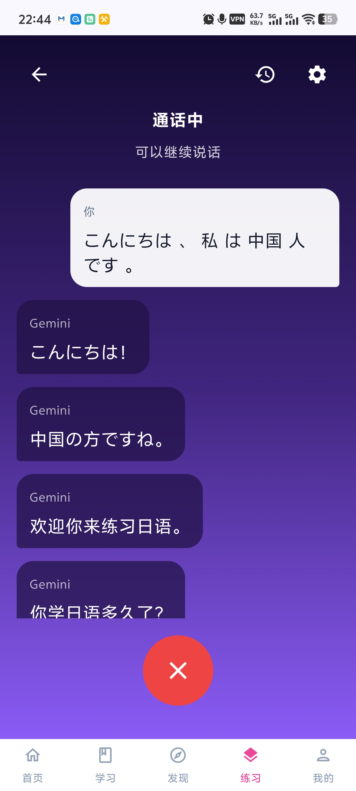
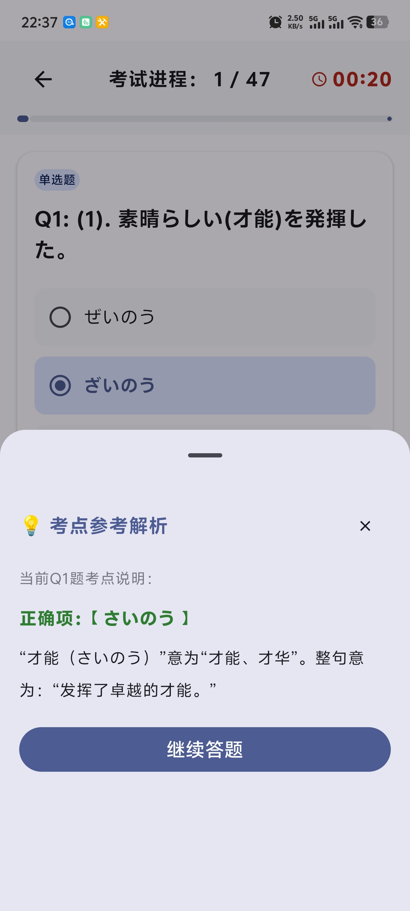

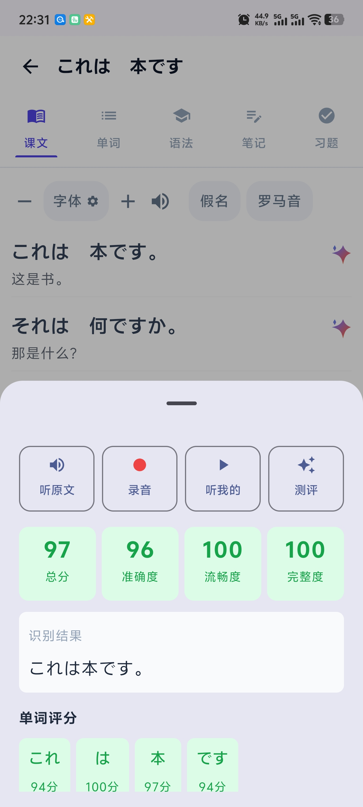
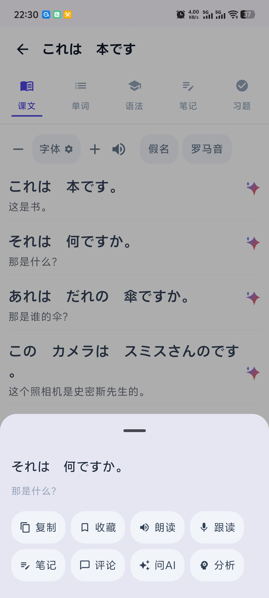
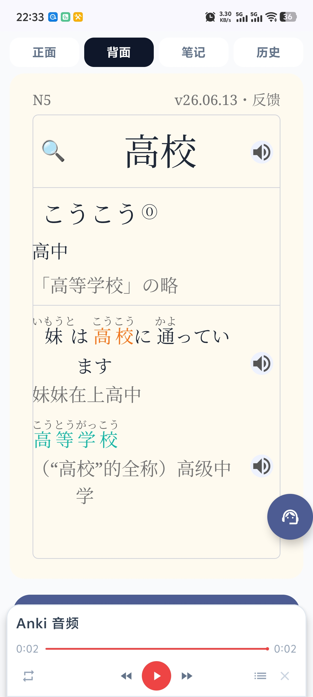
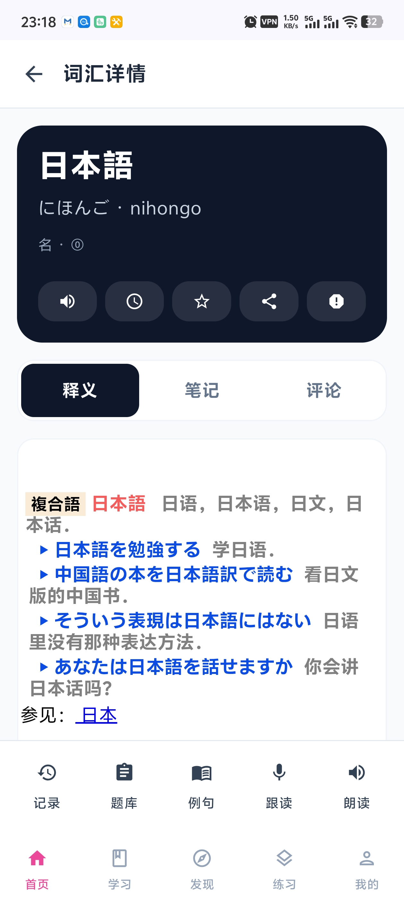
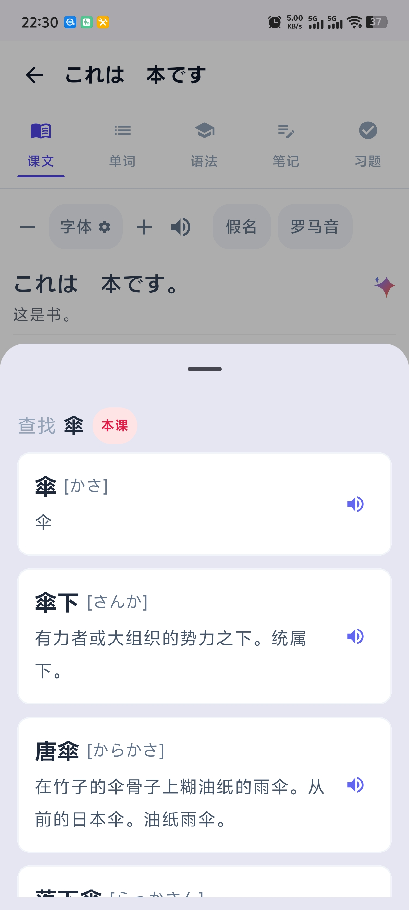
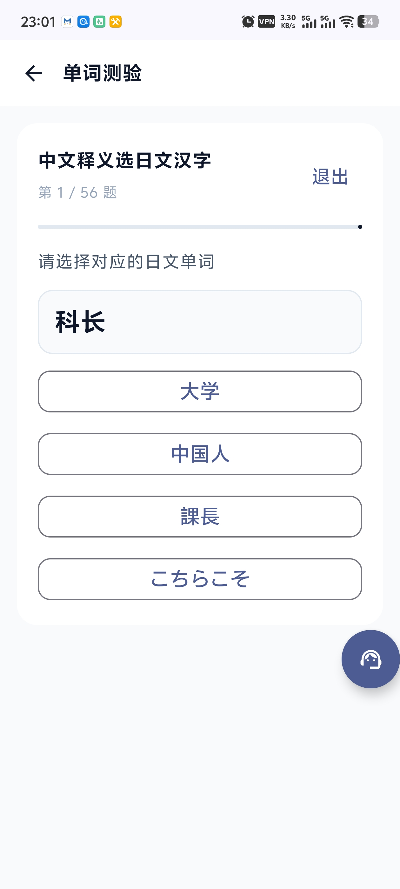
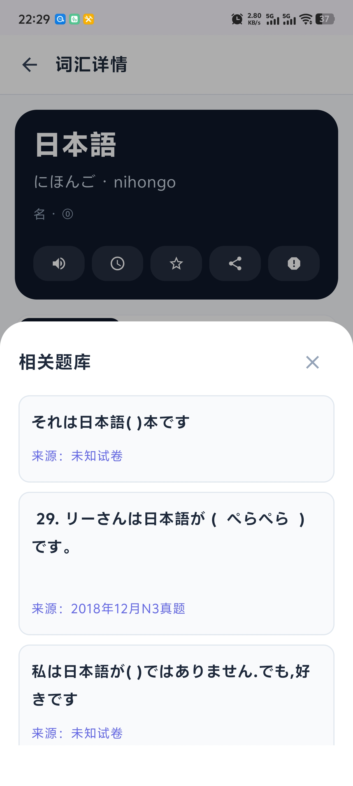
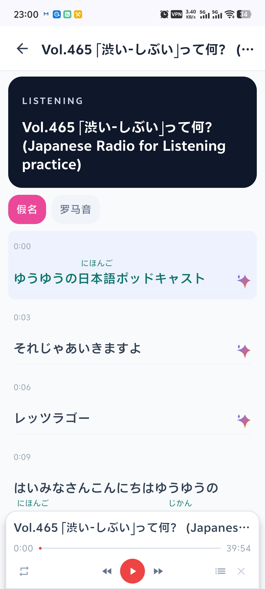
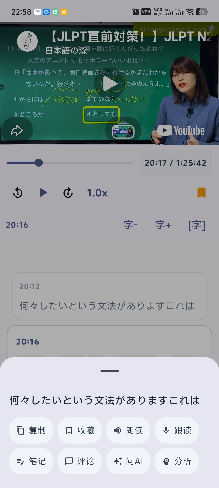
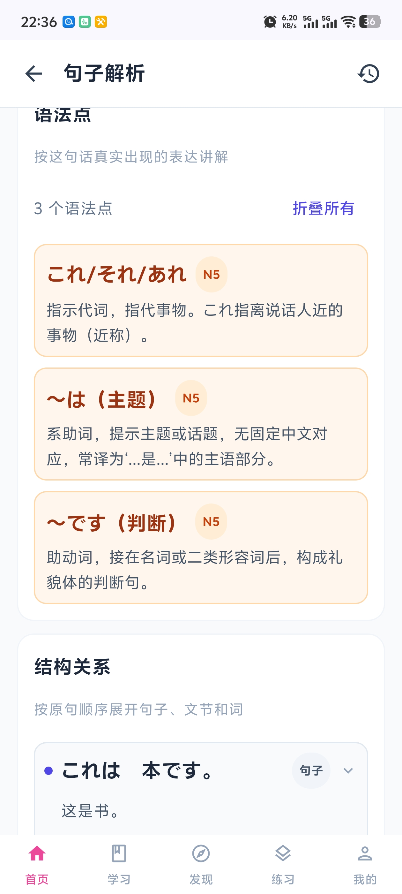
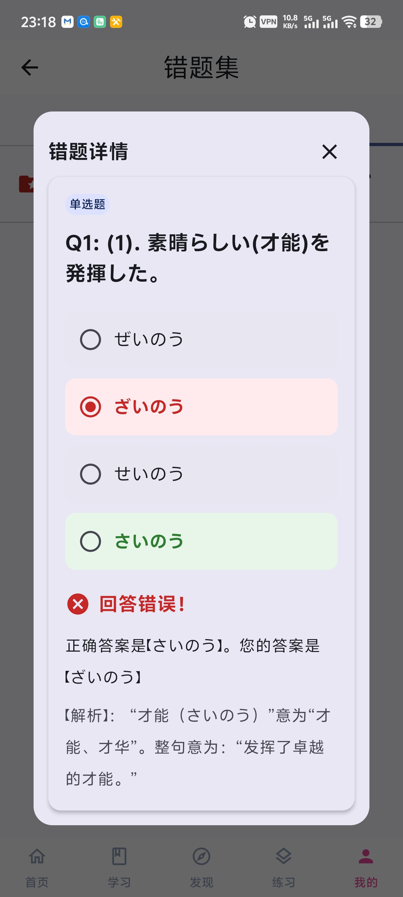
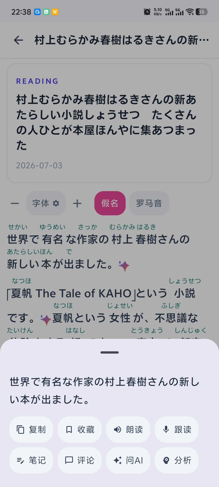
