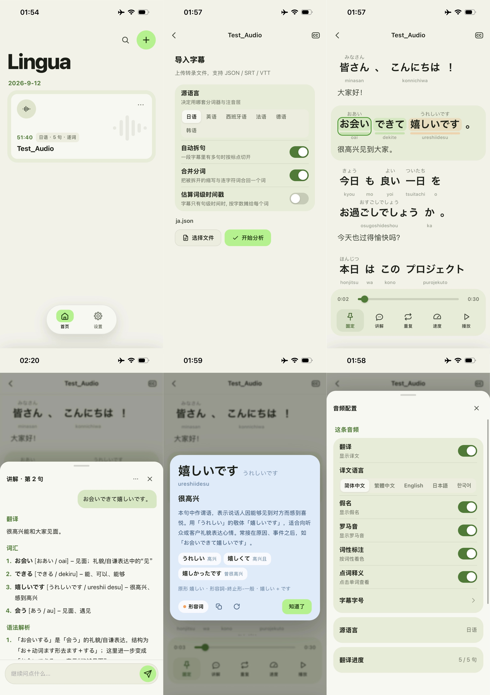

# Lingua

Lingua 是一个面向语言学习的播放器。它把音视频、字幕、逐词时间轴、注音、转写、词性、译文和词汇讲解放在同一条学习流程。支持日语、英语、西班牙语、法语、德语和韩语。

## 功能概览

- 本地导入音频或视频：WAV、MP3、M4A、FLAC、OGG、OPUS，以及 MP4、WebM、MOV 等；
- 导入词级 JSON、带内联时间戳的 WebVTT、普通 SRT / VTT。
- 有词级时间戳时逐词高亮；只有句级时间戳时按整句高亮。
- 日语假名与罗马音、韩语发音与罗马字、英语/西班牙语/法语/德语音标与原形。
- 词性着色、点击单词查看释义、查看句子逐词拆解。
- 浏览器直连 OpenAI 兼容接口，按需生成翻译、词卡和句子讲解。
- 变速播放、单句/整曲重复、自动跟随、和长音频虚拟滚动。
- IndexedDB 本地保存音视频、分析结果与大模型产物；支持用户数据导出、导入。

## 界面预览

