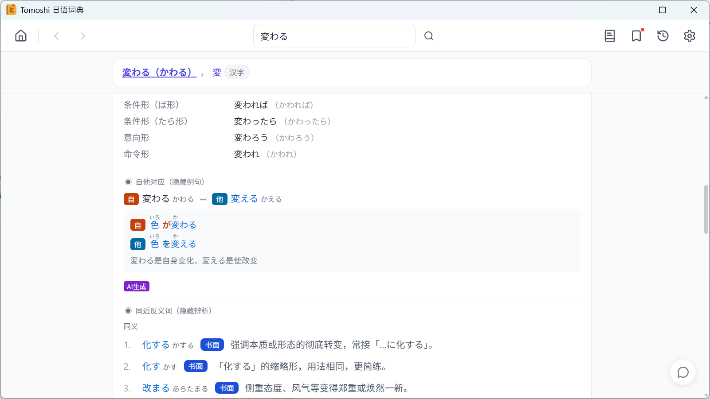
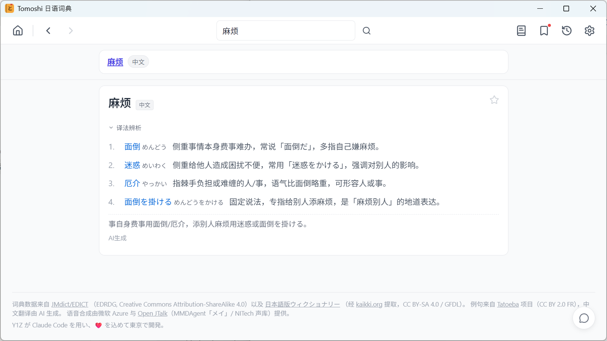

# Tomoshi 日语词典

自己开发的日语词典,顺手推荐一下.跟上面几款「壳 + 自备 mdx 词库」的路子不一样,它自带词典数据,装上就能查,不用到处找词库.Windows / macOS / Android / iPhone 都有,另有 Chrome / Edge / Safari 划词扩展(要开着桌面版,查询由本地桌面版提供,不经过服务器).

我做它的出发点是「说对、写对」:光看懂不够,写日语的时候老纠结该用哪个词.所以除了常规的释义、读音、活用表,重点放在这几块:

- 自他动词成对给(変わる ↔ 変える),例句并排放一起看
- 近义词辨析,一句话说清差在哪
- 中日反查 + 译法辨析:输入「麻烦」,告诉你 面倒 / 迷惑 / 厄介 各用在什么场景
- 每个词带重音标注,常用词的发音有人工核过
- 输入活用形(食べなかった)能直接查到原形

核心查词完全离线,查词记录不上传,查词也不用注册账号.查词永久免费;云端朗读和 AI 讲解是联网功能,目前免费、有每日限额,以后会转成付费来覆盖成本.AI 讲解只在国际版有,大陆版没有.

下载:[tomoshi.app](https://tomoshi.app)(大陆用户走 [tomoshi.cn](https://tomoshi.cn),Android 在应用宝、iPhone 在中国区 App Store)

词典里源自 JMdict 等开放项目的数据,连同中文释义和辨析卡片,按表以 CC BY-SA 等许可公开,可以自己拿去用:[tomoshi-dict-data](https://github.com/tomoshi-app/tomoshi-dict-data)
